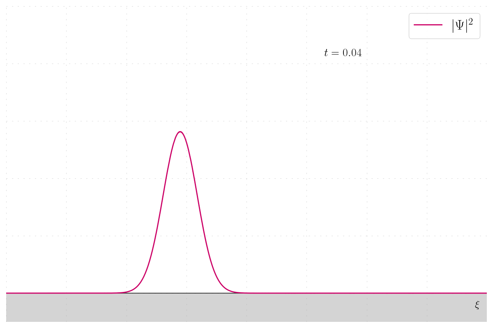

# Schrödinger Equation Simulation

Numerical simulation of the Schrödinger equation in 1D.

## Features

- **Potential Types**:
  - Free space
  - Harmonic oscillator
  - Infinite high barrier
  - Infinite right barrier
  - Finite right barrier

- **Wavefunction Initialization**:
  - Wavepackets
  - Eigenfunctions for the harmonic oscillator or infinite well

- **Visualization**:
  - Probability density
  - Real and imaginary parts of the wavefunction
  - Modulus and phase (color phase)

- **Time Evolution Methods**:
  - Implicit Crank-Nicolson (second-order)
  - Explicit Runge-Kutta (8th order)

## Potential Function

```python
def create_potential(x):
    match p.potential:
        case 0:
            # free space
            return np.zeros(len(x))
        case 1:
            # harmonic oscillator
            return 0.5 * p.m * p.omega**2 * x ** 2
        case 2:
            # infinite high barrier
            V = np.zeros(len(x))
            # with a value too big RK solver is not converging
            V[x <= -p.Vx_bar] = 1e4
            V[x >= p.Vx_bar] = 1e4
            return V
        case 3:
            # infinite right barrier
            V = np.zeros(len(x))
            V[x >= p.Vx_bar] = p.V_barrier
            return V
        case 4:
            # finite right barrier
            V = np.zeros(len(x))
            V[(x >= p.Vx_bar) & (x <= p.Vx_finite_bar)] = p.V_barrier
            return V
        case _:
            raise NotImplementedError(
                f"Potential {p.potential} not implemented")
```

## Getting Started

To get started with these simulations:
1. Clone the repository:
   ```
   git clone https://github.com/azimonti/schrodinger-equation-simulation.git
   ```
2. Navigate to the repository directory:
   ```
   cd schrodinger-equation-simulation
   ```
3. Install required dependencies:
   ```
   pip install -r requirements.txt
   ```
4. Run the simulation scripts:
   ```
   python schrodinger_1d.py
   ```

Some example configurations are available in the `examples_1d` directory.

## Visualization Options

- **Probability Density**:
  Visualize `|\psi(x)|^2`

- **Wavefunction**:
  - Real and imaginary parts
  - Modulus and phase (color phase)

## Time Evolution Methods

- **Implicit Crank-Nicolson**:
  Second-order method for time integration.

- **Explicit Runge-Kutta**:
  8th order method for higher precision in time integration.

## Example Results - Wavepackets

Plain wave probability density:



Harmonic oscillator wavefunction with real and imaginary parts:


Barrier of infinite length wavefunction with phase: 


## Contributing

Contributions to the simulation of Schrödinger project are welcome. Whether it's through submitting bug reports, proposing new features, or contributing to the code, your help is appreciated. For major changes, please open an issue first to discuss what you would like to change.

## License

This project is licensed under the MIT License - see the [LICENSE](LICENSE.md) file for details.

## Contact

This README provides a comprehensive overview of your Schrödinger equation simulation project, including its features, usage instructions, and potential types.

If you have any questions or want to get in touch regarding the project, please open an issue or contact the repository maintainers directly through GitHub.

Thank you for exploring the quantum mechanics of the Schrödinger equation with us!
