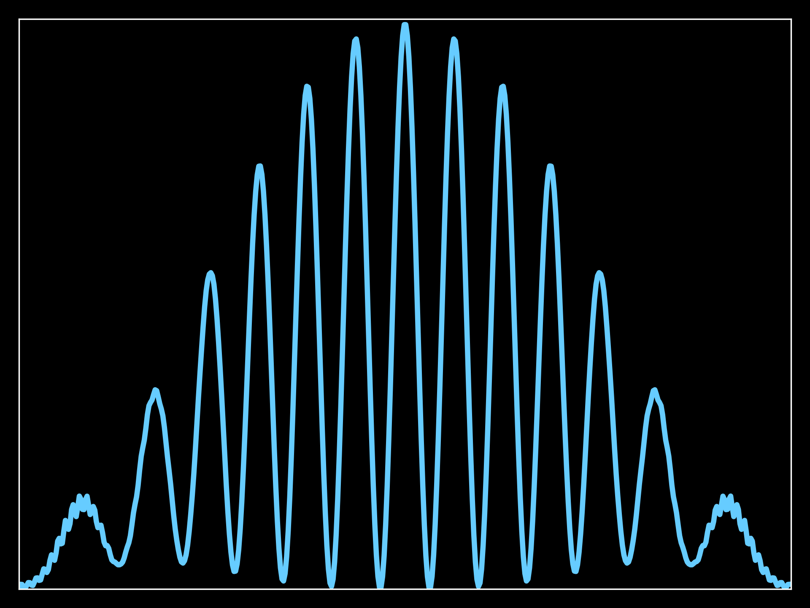
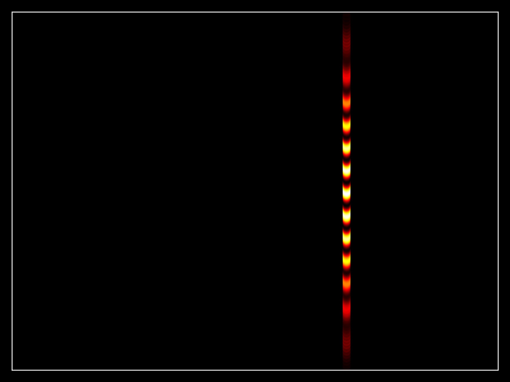
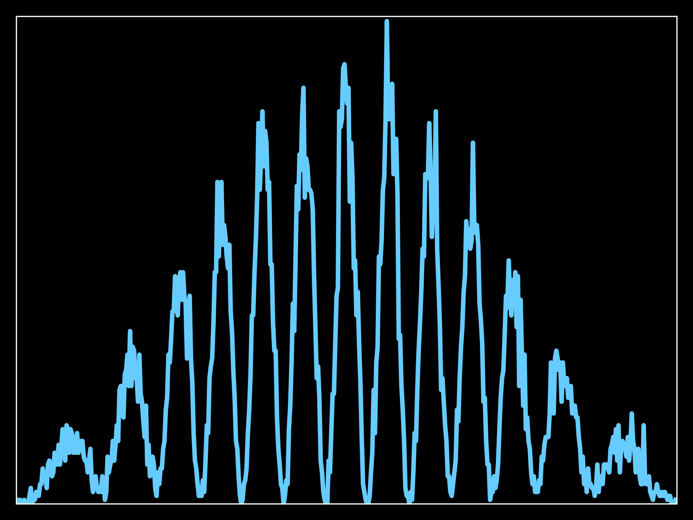

# Schrödinger Equation Simulation - 1D

Numerical simulation of the Schrödinger equation in 1D.

## Features

- **Potential Types**:
  - Free space
  - Harmonic oscillator
  - Infinite high barrier
  - Infinite right barrier
  - Finite right barrier

- **Wavefunction Initialization**:
  - Wavepackets
  - Eigenfunctions for the harmonic oscillator or infinite well

- **Visualization**:
  - Probability density
  - Real and imaginary parts of the wavefunction
  - Modulus and phase (color phase)

- **Time Evolution Methods**:
  - Implicit Crank-Nicolson (second-order)
  - Explicit Runge-Kutta (8th order)

- **Units**:
  - Electron scale units 
  - Normalized units 

## Potential Function

```python
def create_potential(x):
    match p.potential:
        case 0:
            # free space
            return np.zeros(len(x))
        case 1:
            # harmonic oscillator
            return 0.5 * p.m * p.omega**2 * x ** 2
        case 2:
            # infinite high barrier
            V = np.zeros(len(x))
            # with a value too big RK solver is not converging
            V[x <= -p.Vx_bar] = 1e4
            V[x >= p.Vx_bar] = 1e4
            return V
        case 3:
            # infinite right barrier
            V = np.zeros(len(x))
            V[x >= p.Vx_bar] = p.V_barrier
            return V
        case 4:
            # finite right barrier
            V = np.zeros(len(x))
            V[(x >= p.Vx_bar) & (x <= p.Vx_finite_bar)] = p.V_barrier
            return V
        case _:
            raise NotImplementedError(
                f"Potential {p.potential} not implemented")
```

Some example configurations are available in the `examples_1d` directory.

## Visualization Options

- **Probability Density**:
  Visualize `|\psi(x)|^2`

- **Wavefunction**:
  - Real and imaginary parts
  - Modulus and phase (color phase)

## Time Evolution Methods

- **Implicit Crank-Nicolson**:
  Second-order method for time integration.

- **Explicit Runge-Kutta**:
  8th order method for higher precision in time integration.

## Example Results

Plain wave probability density:

https://github.com/user-attachments/assets/ec4be06e-73a4-4d9c-9e4e-94eccea29c00

Barrier of infinite length wavefunction with phase: 

https://github.com/user-attachments/assets/9e189fa3-d9bb-4c7c-89d4-eaf4bdc1da8a

Harmonic oscillator single eigensolution for `n=3` showing no change in the wavefunction magnitude, only a change in the phase:

https://github.com/user-attachments/assets/a62f3526-ee19-4d3e-bbe9-223830be8f4f

# Schrödinger Equation Simulation - 2D

Numerical simulation of the Schrödinger equation in 2D.

## Features

- **Potential Types**:
  - Free space
  - Particle in a box
  - Particle with barrier (in a box or in free space)
  - Particle with multiple slits (in a box or in free space)

- **Wavefunction Initialization**:
  - Wavepackets

- **Visualization**:
  - Probability density
  - Modulus and phase (color phase)

- **Time Evolution Methods**:
  - Implicit Crank-Nicolson (second-order)

- **Units**:
  - Normalized units 

Some example configurations are available in the `examples_2d` directory.

# Double Slit Experiment For Electrons

In this numerical simulation of the double slit experiment with electrons, the Schrödinger equation is used to model a wavepacket passing through a double slit. After interaction with the slits, the simulation calculates the fraction of the wavepacket that reaches a screen positioned behind the slits. This fraction is then used to simulate individual electrons impacting the screen, forming an interference pattern. The vertical position of each electron is randomly distributed uniformly along the vertical axis, simulating slits with a height much greater than their width.

## Example Results

Wavepacket probability distribution at the screen location:



Wavepacket probability distribution at the screen location:



15000 electron beam buildup at the screen location:


15000 electron beam distribution at the screen location, very close to the wavepacket probability as expected:



# Getting Started

To get started with these simulations:
1. Clone the repository:
   ```
   git clone https://github.com/azimonti/schrodinger-equation-simulation.git
   ```
2. Navigate to the repository directory:
   ```
   cd schrodinger-equation-simulation
   ```
3. Install required dependencies:
   ```
   pip install -r requirements.txt
   ```
4. Run the simulation scripts:
   ```
   python schrodinger_1d.py
   python schrodinger_2d.py
   ```

# Contributing

Contributions to the simulation of Schrödinger project are welcome. Whether it's through submitting bug reports, proposing new features, or contributing to the code, your help is appreciated. For major changes, please open an issue first to discuss what you would like to change.

# License

This project is licensed under the MIT License - see the [LICENSE](LICENSE.md) file for details.

# Contact

This README provides a comprehensive overview of your Schrödinger equation simulation project, including its features, usage instructions, and potential types.

Please refer to these articles ([here](https://www.azimonti.com/programming/simulations/qm/1d-schrodinger-equation.html), [here](https://www.azimonti.com/programming/simulations/qm/2d-schrodinger-equation.html), and [here](https://www.azimonti.com/programming/simulations/qm/electron-double-slit-experiment.html)) for more detail explaination of the numerical aspects of these simulations.

If you have any questions or want to get in touch regarding the project, please open an issue or contact the repository maintainers directly through GitHub.

Thank you for exploring the quantum mechanics of the Schrödinger equation with us!
